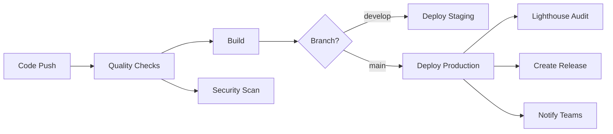

# 🚀 CI/CD Pipeline Guide - AyanBridge

## 📋 Overview

This document outlines the complete CI/CD pipeline setup for the AyanBridge project, including automated testing, building, security scanning, and deployment to Vercel.

## 🏗️ Pipeline Architecture



## 🔄 Workflow Jobs

### 1. Quality Checks (`quality-checks`)
**Triggers:** All pushes and PRs
**Purpose:** Ensure code quality and catch issues early

**Steps:**
- ✅ Checkout code
- ✅ Setup Node.js 18
- ✅ Install dependencies
- ✅ Run ESLint (with error tolerance)
- ✅ TypeScript type checking
- ✅ Run tests with coverage
- ✅ Upload coverage to Codecov

### 2. Build Application (`build`)
**Triggers:** After quality checks pass
**Purpose:** Verify the application builds successfully

**Steps:**
- ✅ Checkout code
- ✅ Setup Node.js environment
- ✅ Install dependencies
- ✅ Build for production
- ✅ Upload build artifacts

### 3. Security Scan (`security-scan`)
**Triggers:** All pushes and PRs
**Purpose:** Identify security vulnerabilities

**Steps:**
- ✅ Run npm audit
- ✅ Snyk vulnerability scanning
- ✅ Security threshold: High severity and above

### 4. Deploy to Staging (`deploy-staging`)
**Triggers:** Push to `develop` branch
**Purpose:** Deploy to staging environment for testing

**Environment:** `staging`
**Steps:**
- ✅ Install Vercel CLI
- ✅ Pull staging environment config
- ✅ Build project artifacts
- ✅ Deploy to Vercel preview

### 5. Deploy to Production (`deploy-production`)
**Triggers:** Push to `main` branch
**Purpose:** Deploy to production environment

**Environment:** `production`
**Steps:**
- ✅ Install Vercel CLI
- ✅ Pull production environment config
- ✅ Build for production
- ✅ Deploy to Vercel production
- ✅ Create GitHub release

### 6. Lighthouse Audit (`lighthouse-audit`)
**Triggers:** After successful production deployment
**Purpose:** Performance and quality assessment

**Metrics:**
- 🚀 Performance: >80%
- ♿ Accessibility: >90%
- 🛡️ Best Practices: >85%
- 🔍 SEO: >80%
- 📱 PWA: >70%

### 7. Notifications (`notify`)
**Triggers:** After production deployment (success/failure)
**Purpose:** Team communication

**Channels:**
- 📢 Slack notifications
- 📧 Email alerts (optional)

## ⚙️ Configuration Files

### GitHub Actions Workflow
**File:** `.github/workflows/ci-cd.yml`
- Complete CI/CD pipeline definition
- Multi-stage deployment process
- Error handling and notifications

### Vercel Configuration
**File:** `vercel.json`
- Deployment settings
- Security headers
- Caching strategies
- URL rewrites for SPA

### Lighthouse Configuration
**File:** `.lighthouserc.json`
- Performance audit settings
- Quality thresholds
- Report generation

## 🔐 Required Secrets

### GitHub Repository Secrets
Set these in GitHub Settings > Secrets and variables > Actions:

```bash
# Vercel Integration
VERCEL_TOKEN=<set-in-repository-secrets>
VERCEL_ORG_ID=<set-in-repository-secrets>
VERCEL_PROJECT_ID=<set-in-repository-secrets>

# Security Scanning
SNYK_TOKEN=<set-in-repository-secrets>

# Notifications
SLACK_WEBHOOK_URL=<set-in-repository-secrets>

# GitHub (automatically provided)
GITHUB_TOKEN=automatically_provided
```

### Environment Variables (Vercel Dashboard)
Configure in Vercel Dashboard > Settings > Environment Variables:

```bash
# Build Configuration
NODE_ENV=production
VITE_BUILD_TARGET=vercel
CI=true

# Optional Performance
TSC_COMPILE_ON_ERROR=true
ESLINT_NO_DEV_ERRORS=true
DISABLE_ESLINT_PLUGIN=true
GENERATE_SOURCEMAP=false
```

## 🚀 Getting Started

### 1. Initial Setup

```bash
# Clone and setup the repository
git clone <repository-url>
cd ayanbridge
npm install

# Test local build
npm run build
npm run preview
```

### 2. Configure Vercel

```bash
# Install Vercel CLI
npm install -g vercel

# Link project
vercel link

# Set up environment variables
vercel env add NODE_ENV production
vercel env add VITE_BUILD_TARGET vercel
```

### 3. Configure GitHub Secrets

1. Go to Repository Settings > Secrets and variables > Actions
2. Add all required secrets listed above
3. Ensure proper permissions for GitHub Actions

### 4. Test the Pipeline

```bash
# Create a feature branch
git checkout -b feature/test-cicd

# Make a small change
echo "// Test CI/CD" >> src/main.tsx

# Commit and push
git add .
git commit -m "test: verify CI/CD pipeline and added new invest feature"
git push origin feature/test-cicd

# Create a PR to trigger the pipeline
```

## 📊 Monitoring and Maintenance

### Pipeline Health Checks
- ✅ Weekly review of build times
- ✅ Monthly dependency updates
- ✅ Quarterly security audit reviews
- ✅ Performance metric tracking

### Key Metrics to Monitor
- 📈 Build success rate (target: >95%)
- ⏱️ Build duration (target: <5 minutes)
- 🛡️ Security scan results
- 🚀 Lighthouse scores
- 📊 Deployment frequency

### Troubleshooting Common Issues

#### Build Failures
```bash
# Check Node.js version compatibility
node --version  # Should be 18.x

# Verify dependencies
npm audit
npm outdated

# Clean install
rm -rf node_modules package-lock.json
npm ci
```

#### Deployment Issues
```bash
# Verify Vercel configuration
vercel inspect

# Check environment variables
vercel env ls

# Manual deployment test
vercel --prod
```

#### Security Scan Failures
```bash
# Fix npm vulnerabilities
npm audit fix

# Update dependencies
npm update

# Check Snyk recommendations
npx snyk test
```

## 🔧 Customization Options

### Adding New Environments
1. Create new Vercel project
2. Add environment-specific secrets
3. Update workflow with new job
4. Configure branch-specific triggers

### Extending Quality Checks
```yaml
# Add to quality-checks job
- name: Run Custom Linting
  run: npm run lint:custom

- name: Check Bundle Size
  run: npm run analyze

- name: Run E2E Tests
  run: npm run test:e2e
```

### Adding Deployment Targets
```yaml
# New deployment job
deploy-mobile:
  name: Deploy Mobile App
  runs-on: ubuntu-latest
  needs: [quality-checks, build]
  steps:
    - name: Deploy to App Store
      run: npm run deploy:mobile
```

## 📝 Best Practices

### Branch Strategy
- `main` → Production deployments
- `develop` → Staging deployments
- `feature/*` → Feature development
- `hotfix/*` → Emergency fixes

### Commit Conventions
```bash
feat: add new feature
fix: bug fix
docs: documentation changes
style: formatting changes
refactor: code refactoring
test: add tests
chore: maintenance tasks
```

### Security Guidelines
- ✅ Never commit secrets or API keys
- ✅ Use environment variables for configuration
- ✅ Regular dependency updates
- ✅ Enable branch protection rules
- ✅ Require PR reviews before merge

## 🆘 Support and Troubleshooting

### Common Commands

```bash
# Local development
npm run dev           # Start development server
npm run build         # Build for production
npm run preview       # Preview production build
npm run lint          # Run linting
npm test             # Run tests

# Vercel commands
vercel               # Deploy to preview
vercel --prod        # Deploy to production
vercel logs          # View deployment logs
vercel env ls        # List environment variables
```

### Getting Help

1. **GitHub Issues**: Check existing issues or create new ones
2. **Documentation**: Review Vercel and GitHub Actions docs
3. **Team Slack**: `#tech-support` channel
4. **Email**: tech-support@ayanbridge.com

### Emergency Procedures

#### Production Hotfix
```bash
# Create hotfix branch from main
git checkout main
git pull origin main
git checkout -b hotfix/critical-fix

# Make fixes, test, and commit
git add .
git commit -m "fix: critical production issue"

# Push and create PR
git push origin hotfix/critical-fix
# Create PR targeting main branch
```

#### Rollback Deployment
```bash
# Using Vercel CLI
vercel rollback

# Or redeploy previous version
git checkout <previous-commit>
vercel --prod
```

---

## 📚 Additional Resources

- [Vercel Documentation](https://vercel.com/docs)
- [GitHub Actions Documentation](https://docs.github.com/en/actions)
- [Vite Configuration Guide](https://vitejs.dev/config/)
- [React Deployment Best Practices](https://react.dev/learn/start-a-new-react-project)

---

**📅 Last Updated:** January 2025  
**🔄 Version:** 1.0.0  
**👥 Maintained by:** AyanBridge Development Team